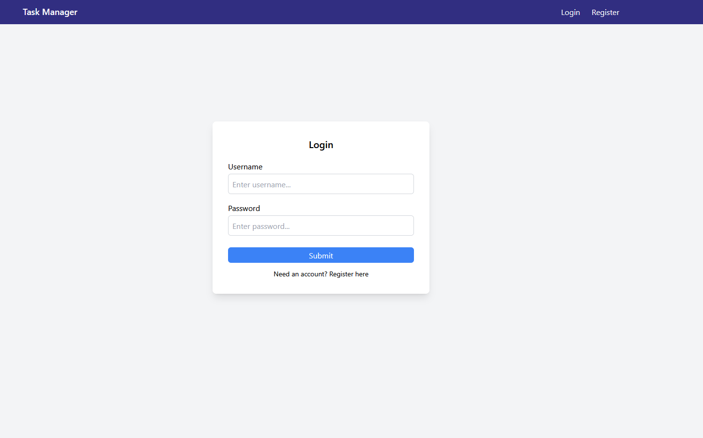
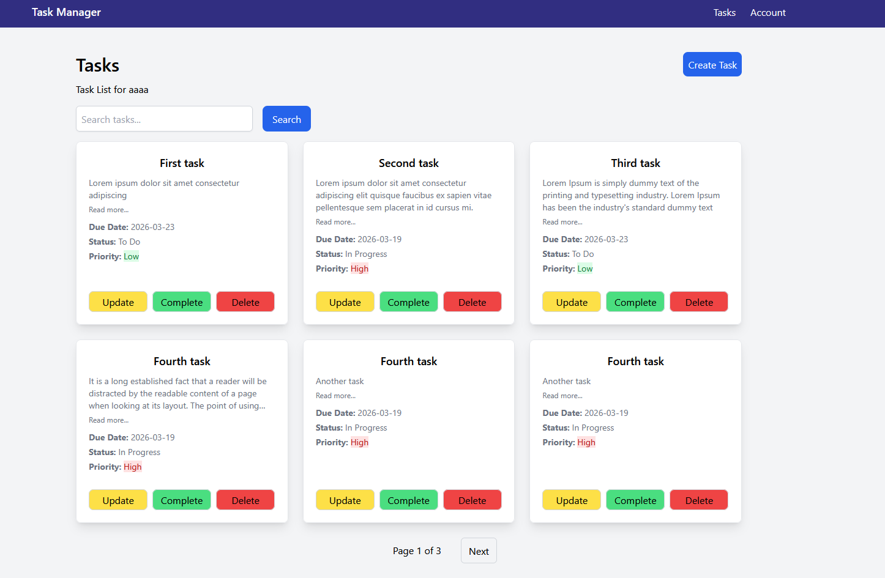
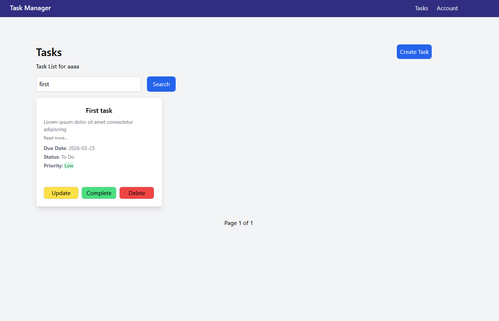
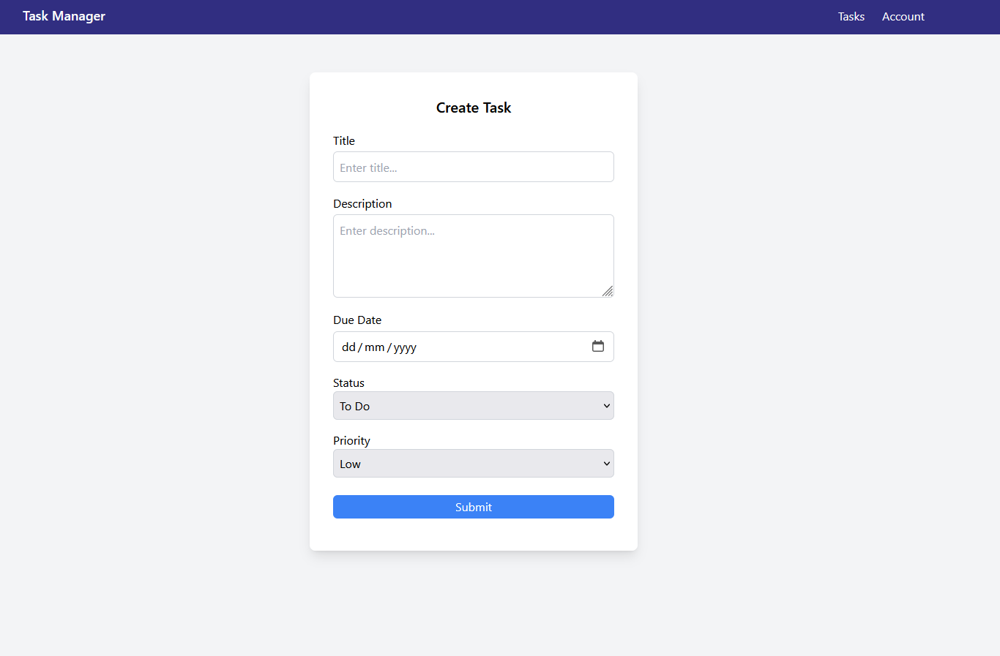
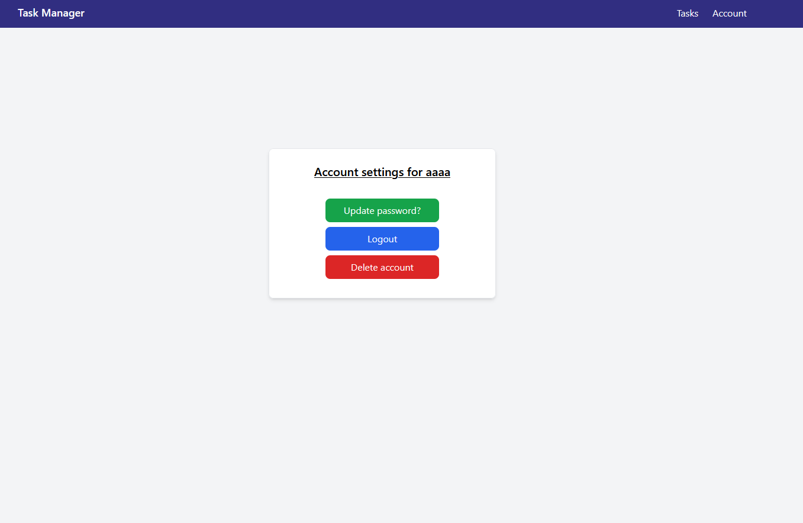
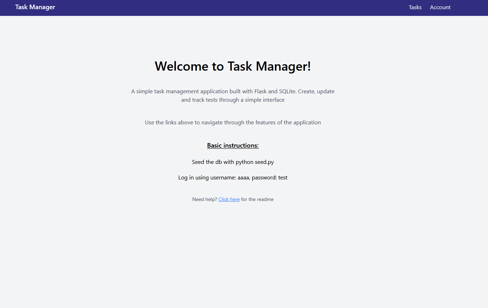

# Task Manager Application

A web application that allows users to create and manage personal tasks through a simple interface.

## Screenshots


| Login                             | Tasks                              |
|-----------------------------------|------------------------------------|
|||

| Search                                | Create                               |
|---------------------------------------|--------------------------------------|
|||

| Account | Index |
|---------|-------|
|||


## Technologies Used

* Python
* Flask
* Flask-Login
* Tailwind CSS
* SQLite
* SQLAlchemy
* Jinja2


## Features
	
### User Authentication

* Register user
* Login/Logout
* Update password
* Delete account

### Task Management

* Create tasks
* Update tasks
* Complete tasks
* Delete tasks

### Application Features

* Search function
* Pagination
* Responsive design


## Installation

### Clone the repository

`git clone https://github.com/mpbe/TaskManager.git`


### Navigate to project folder

`cd TaskManager`


### Create virtual environment

`python -m venv venv`


### Activate virtual environment

Windows: 

`venv\Scripts\activate`

Mac/Linux:

`source venv/bin/activate`


### Install dependencies

`pip install -r requirements.txt`


### Run the application

`python app.py`


### Open in browser

http://127.0.0.1:5000


## Usage

You can either create your own account or seed the database with test data.

### Seed the database:

`python seed.py`

### Main test user:

* **username**: *aaaa*
* **password**: *test*

If a user is registered they will be automatically logged in.

Tasks can be viewed individually by clicking the *More Details* button


## Project Structure

```
app/
├── forms/
├── models/
├── routes/
├── schemas/
├── services/
├── templates/
│   └── partials/
└── utils/

screenshots/
tests/
```


## Future Improvements

* Task categories
* Task sorting
* Account verification
* Rest API support